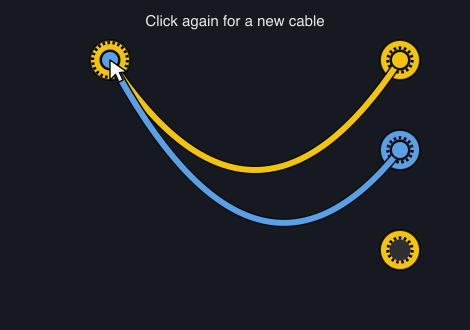
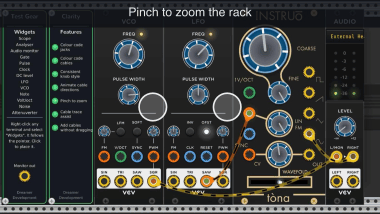

# Clarity

Clarity changes how the rack is drawn and how you interact with it. It does not process audio and does not alter the patch.

The interaction features were developed on a trackpad and are designed for one. All of them work with a mouse except pinch to zoom, which requires a trackpad gesture.


*A rack running Clarity: one knob face across three plugins, ports coloured by signal family, and a cable whose dashes drift towards its destination.*

Place one anywhere in the rack. A second has no effect. The panel lists the features under the heading **Features**, one switch per row, lit when that feature is enabled.

---

## Reading the rack

### Colour code ports

Every port in the rack is given a coloured ring for its signal family, determined from the port's name:

| Family | Input | Output | Ports named like |
| --- | :---: | :---: | --- |
| Audio |  |  | anything not matched below |
| CV |  |  | CV, MOD, FM |
| Gate and trigger |  |  | GATE, TRIG, CLOCK, CLK, RESET, SYNC |
| Pitch |  |  | V/OCT, PITCH, NOTE, BPM |

BPM is in the pitch family because a BPM control voltage is volt per octave: it doubles per volt, so nought volts is 120 beats per minute, one volt is 240 and minus one is 60. The only difference from a note is what it sets. A port named as both, such as "BPM clock", is read as a clock, since the trigger rules are tested first.

A fifth family, **MPX**, is given to ports named for the Modular Polyphonic Expression plugin, whose cables carry note events rather than a voltage. It is drawn in magenta, and has no pictures here.

The same ring also indicates direction: it is drawn against the **outer edge** on an output, and against the **hole** on an input. Colour indicates the signal family; position indicates the direction.

The port name is read from the module itself, so this applies to modules with no entry in any list, including plugins released after this one.

The pictures above are drawn by `docs/images/make-jacks.py`, from the same geometry the plugin uses.

### Colour code cables

A cable is drawn in the colour of the family of the port it **arrives** at. Reconnected elsewhere, it is redrawn in the colour of the new destination. A cable being carried is drawn in the colour of the port it was taken from.

| Family | Cable |
| --- | --- |
| Audio |  |
| CV |  |
| Gate and trigger |  |
| Pitch |  |

An audio cable moved to a gate input, and the resulting change of colour:


Rack stores cable colours in the patch. A colour set manually is not overwritten.

Switching **Colour code cables** off puts every cable back to the colour it had before, as does removing the last Clarity module. **Put cable colours back** on the right-click menu does the same without switching anything off. The switch is off by default: cable colours belong to the patch, and a module that changed them the moment it was placed would be taking a decision that is not its to take.

### Choosing the colours

**Port and cable colours…** on the right-click menu opens a chooser: five swatches across the top, a colour wheel with hue around it and saturation out from the centre, and a brightness bar under it.

The colours are stored in `<Rack user folder>/DreamerDevelopment/colours.json`, beside Rack's own settings rather than in the patch. They describe the person looking rather than the work, so opening somebody else's patch does not change how your rack is coloured.

**Colour scheme** on the right-click menu replaces all five at once:

| Scheme | Audio | CV | Gate | Pitch |
| --- | --- | --- | --- | --- |
| Omri Cohen (default) | red | green | blue | yellow |
| Dreamer Development | yellow | orange | blue | green |

The first is the convention used in Omri Cohen's tutorials, which is the one most widely seen, and it is what this plugin uses. The second is the set it shipped with; the two disagree about yellow, which means audio in one and pitch in the other.

### Correcting a family

The family is guessed from the port's name, and a name does not always say. A port called "Rate" is modulation on one module and a clock on the next.

**Right-click the port** and use **Signal family** to set it, or **Automatic** to go back to guessing. The choice is stored against the module's model rather than against the patch, so a port corrected once is correct in every patch that uses that module.

To categorise by name instead, add a `rules` list to `colours.json`. Each rule gives a piece of text to look for in the port's name and the family a port matching it belongs to. Rules are tested in the order written, before the built-in list, and the text is matched anywhere in the name without regard to case.

```json
{
  "audio": "#c91847",
  "cv": "#0c8e15",
  "trigger": "#0986ad",
  "pitch": "#c9b70e",
  "mpx": "#ff3cc8",
  "rules": [
    { "match": "bpm", "family": "pitch" },
    { "match": "rate", "family": "cv" }
  ],
  "ports": {
    "Venom/AD_ASR/out/3": "cv"
  }
}
```

The family names are `audio`, `cv`, `trigger`, `pitch` and `mpx`. The `ports` block is what the port's own menu writes; the key names the plugin, the model, the direction and the port number. A rule the reader cannot make sense of is passed over, and the rest of the file is still read.

The file is read once, when the first colour is needed. Rack must be restarted after editing it by hand.

### Consistent knob style

Draws one knob face over every knob in the rack, whatever the plugin.


*The face, with its pointer and grip ticks.*


*Two Fundamental modules and an Instruo, drawn the same way.*

Knobs are drawn over each module, so a module that draws an illuminated ring around a knob will have that ring obscured. Disable this feature in that case; the same note appears in the right-click menu.

### Animate cable directions

Dashes drift along every cable from source to destination. Dash length is set by the destination's signal family — short for audio, long for gates — so the dashes indicate both the direction and the family.


*The drift runs from the output towards the input, in whatever direction the cable lies on screen.*

The drift indicates direction only. It is not synchronised with the signal and does not represent its amplitude, rate or content.

---

## Handling cables

### Cable trace assist

Hovering either end of a cable displays a small handle on it. Clicking the handle leaves that cable at full opacity and hides every other cable in the rack. Clicking any module panel restores them.


*The other cables are hidden, not dimmed.*

Where several cables meet at one port, repeated clicks on the handle select each of them in turn.

**Right-click the handle** to disconnect that cable from its port.

### Add and move cables without dragging

The mouse button does not have to be held down. Creating a cable at an unconnected port:


Moving a cable that is already connected:


Click a port to take its cable, move the pointer, and click another port to connect it. Press, drag and release also works: a release after any movement places the cable, connecting it if the pointer is over a port. Both gestures are active at the same time, and a connection may be started with one and completed with the other. Right-click cancels either. The rack scrolls when a carried cable reaches the edge of the view.

One behaviour differs from unmodified Rack: a click on a port with no movement takes the cable, where Rack takes no action.

### Several cables on one port

An output can hold several cables, and a click takes the topmost one. Clicking the same port again, with the pointer still over it, replaces the carried cable with the next one the port holds: each cable in turn, then a new cable, then no cable, then the first again.


*One click for the topmost cable, a second for the one below it.*

Creating a third cable at the same port, with both existing cables still connected:



*The third click produces a new cable. Neither existing cable is disconnected.*

The states are not labelled. A carried cable is drawn at full opacity while the others are drawn at half, and it remains connected at its far end; a new cable is drawn from the clicked port to the pointer.

Rack provides this through a modifier key. Repeated clicks provide it without one, and also select the cables below the topmost.

Nothing is written to the undo history until the cable is placed, so four clicks produce one entry. Right-clicking while carrying returns the cable to the port it was taken from.

### Pinch to zoom



Pinch on a trackpad to zoom the rack. The rack is captured as an image once when the gesture begins, and that image is scaled during the gesture, with the zoom level applied on release; no module is redrawn while the gesture is in progress. The image is correspondingly less sharp as the zoom increases, and is redrawn at full resolution on release.

Pinching with the pointer over an analyser zooms that analyser's frequency axis instead of the rack.

---

## The right-click menu

- **Draw pointer (for screen recordings)** — draws a pointer into the rack, indicating clicks, drags and scrolling. Screen recorders capture the window contents and not the system cursor.
- **Draw movement trail** — the trail the drawn pointer leaves behind it while a button is held. Separate from the pointer itself, so one can be had without the other.
- **Show hints again** — brings back the hints that are shown once and then dismissed.
- **Port and cable colours…** — the colour chooser, described above.
- **Colour scheme** — replaces all five colours with a named scheme.
- **Put cable colours back** — restores every cable to the colour it had before Clarity coloured it.

---

## Notes

**One module is sufficient.** A second has no effect; removing the last one disables the features.

**No audio processing.** Clarity has no ports and performs no processing. Bypassing it has no effect.

**The features are parameters**, so they are saved with the patch, can be mapped to a controller, and appear in Rack's own right-click menu for each switch.
