# Clarity

User interface clarity: this module changes how the rack is drawn and handled. It does nothing to the sound and nothing to your patch: every feature is about reading what is in front of you and getting hold of it.

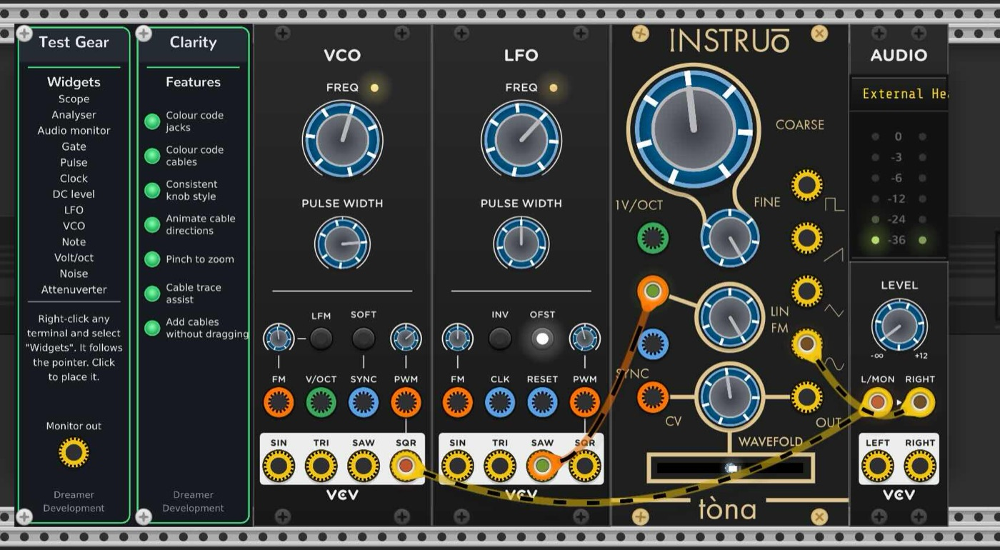

Place one anywhere in the rack. There is no need for a second — one module drives the whole rack, and its panel is the feature list under the heading **Features**. Each row is a switch, lit when the feature is on.

---

## Reading the rack

### Colour code jacks

Every jack in the rack gets a coloured ring by signal family, guessed from the port's own name:

| Family | Input | Output | Ports named like |
| --- | :---: | :---: | --- |
| Audio |  |  | anything not matched below |
| CV |  |  | CV, MOD, FM |
| Gate and trigger |  |  | GATE, TRIG, CLOCK, CLK, RESET, SYNC |
| Pitch |  |  | V/OCT, PITCH, NOTE |

The same ring says which way the signal goes: it hugs the **outer edge** of an output and the **hole** of an input. Shape carries direction and colour carries family, so the two readings never have to compete for the same cue.

The pictures above are drawn by `docs/images/make-jacks.py`, from the same geometry the plugin uses, so they can be redrawn when the drawing changes rather than being screenshots that quietly go out of date.

Because the naming is read from the port itself, this works on modules nobody has described by hand, including plugins released after this one.

### Colour code cables

A cable takes the colour of the family of the port it **arrives** at, so where it is going is visible from either end. Re-plug it somewhere else and it takes the new colour. A cable in flight is coloured from the port it left, so it reads as that signal from the moment it leaves the jack.

| Family | Cable |
| --- | --- |
| Audio |  |
| CV | 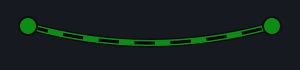 |
| Gate and trigger | 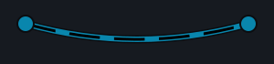 |
| Pitch | 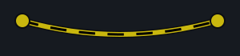 |

Pulling an audio cable onto a gate input, and the colour following it:

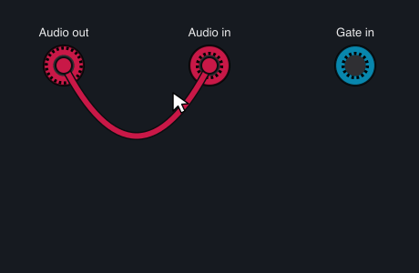

Rack saves cable colours in the patch. Change one by hand and it is left alone from then on.

### Consistent knob style

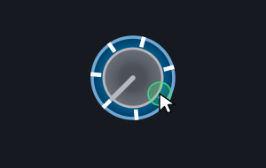

Draws one knob face over every knob in the rack, whatever the plugin. Two Fundamental modules and an Instruo, all reading the same way:

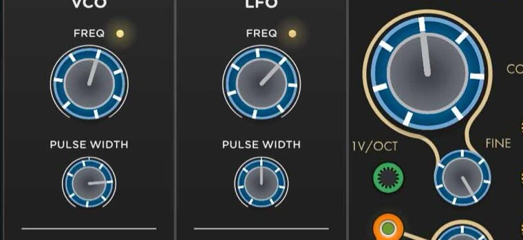 Knobs are drawn on top of each module, so a module that draws its own light-emitting ring around a knob will have it covered. If that matters to you, switch this off; the note is repeated in the right-click menu.

### Animate cable directions

Dashes crawl along every cable from source to destination. Dash length is keyed to the destination's family — fine for audio, coarse for gates — so a glance tells you both the direction and roughly what is travelling.

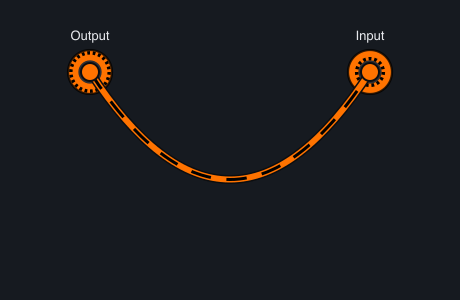

The crawl states direction only. It is not synchronised with the signal, and says nothing about what the signal is doing.

---

## Handling cables

### Cable trace assist

Hover either end of a cable and a small pill appears on it. Click the pill and that cable stays bright while every other cable in the rack is hidden, which is how you follow one lead through a tangle. Click again to put it back.

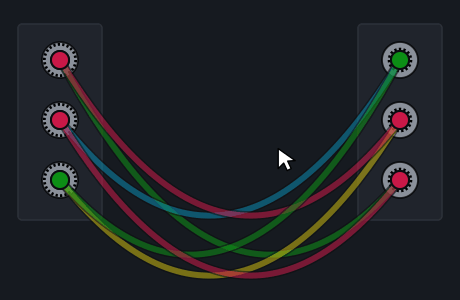

Where several cables converge on one jack, clicking the pill steps through them one at a time.

**Right-click the pill** to lift that particular cable off its jack — useful when the cable you want is the one underneath four others.

### Add cables without dragging

You no longer have to hold the button down to move a cable.

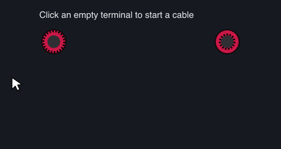

Moving one that is already patched works the same way:

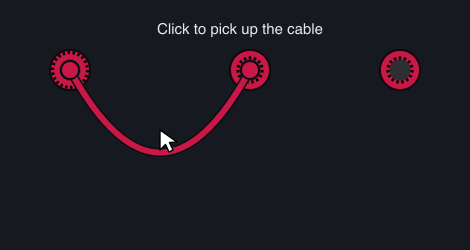

Click a jack to pick up its cable, move, and click another jack to drop it. Or press, drag and release as you always have — a release after any movement lands the cable, connecting it if it is over a jack. Both gestures are live at once, so whichever you do is right, and you can start one way and finish the other. Right-click cancels either way, and the rack scrolls itself when a carried cable reaches the edge of the view.

A note appears beside the jack each time a cable comes off one, because nobody would guess that letting go of the button is allowed. It stays until you close it, it moves to the new jack if you pick up another cable, and it keeps appearing until you tick **Don't show this again** and press OK. **Show tips again** in the right-click menu brings it back.

This is the one feature that ships **on** and still has a switch, which is the opposite of how it started. There is nothing to choose between the two gestures, so the switch is not really a choice — it is there because one behaviour does differ from stock Rack, and because a gesture this fundamental should have a visible way out. The difference: a click on a jack that never moves picks the cable up, where Rack would do nothing.

### Pinch to zoom

Pinch on a trackpad to zoom the rack. The rack is photographed once when the gesture starts and that picture is scaled while you pinch, with the real zoom applied when you let go — so nothing re-rasterises during the gesture and it stays smooth in a large patch. The picture softens as you zoom in and sharpens the moment you release.

Pinching over an analyser zooms **its** frequency axis instead, since that is the thing under your fingers.

---

## The right-click menu

- **Draw pointer (for screen recordings)** — draws a pointer into the rack, with clicks, drags and scrolling shown. Screen recorders capture the window and not the system cursor, so a recording of a patch being worked on otherwise shows things happening with nothing touching them.
- **Show tips again** — forgets every "Don't show this again". The answers are kept beside Rack's own settings rather than in the patch, since whether you want to be told something is about you and not about the work.

---

## Notes

**One module is enough.** A second changes nothing; the last one you take out switches the features off.

**Nothing here touches audio.** Clarity has no ports and does no processing. Bypassing it stops nothing, because there is nothing in the signal path to stop.

**The features are params**, so they are saved with the patch, they can be mapped to a controller, and they show up in Rack's own right-click menu for each switch.

